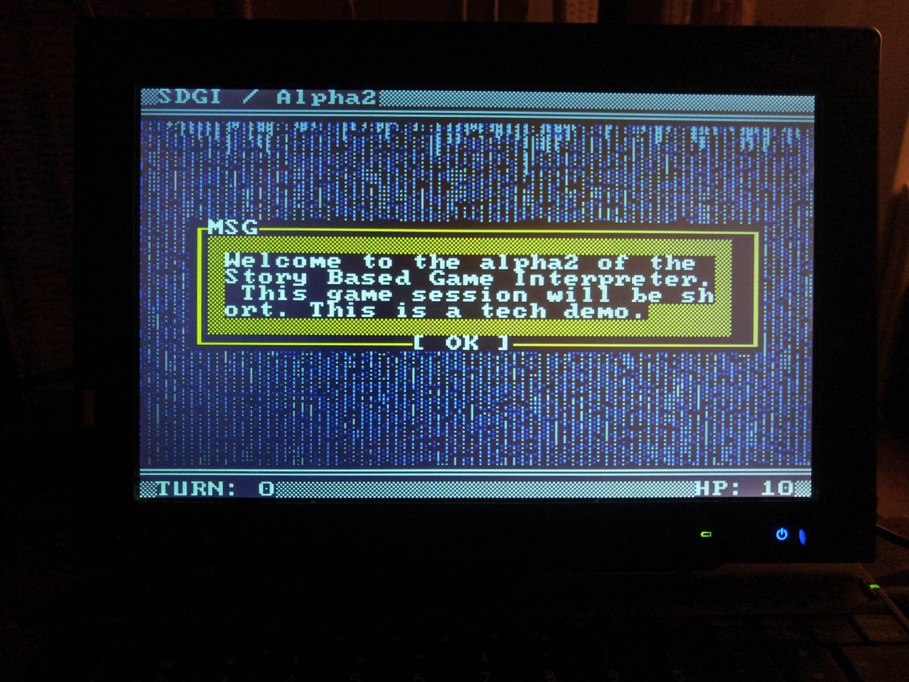

# Interactive Fiction BASIC Engine

Made on a real DOS maschine (MS DOS 5.5) in QuickBASIC 4.5.

More about my [developer DOS setup here](https://bits.p1x.in/using-ms-dos-and-wordstar-in-2021/).

My game engine for [Interactive Fiction](https://en.wikipedia.org/wiki/Interactive_fiction), text-based games for DOS. It uses super simple script language for the gameplay logic (the story.)

## ChangeLog

- 1.0 - initial logic w/ scritp parser
- 2.0 -> 4.0 - refctors, proper sound handling, menu
- 5-0 - intro w/ 3D model, word-wrapping
- 6.0 - optimalizations, color palette visualization
- 7.0 - refactor draw window
- 8.0 - ...
- 9.0 - rename, custom arne 16 palette, layout cleanup

## Planned

- 10.0 - demo story that utilize all the engine features
