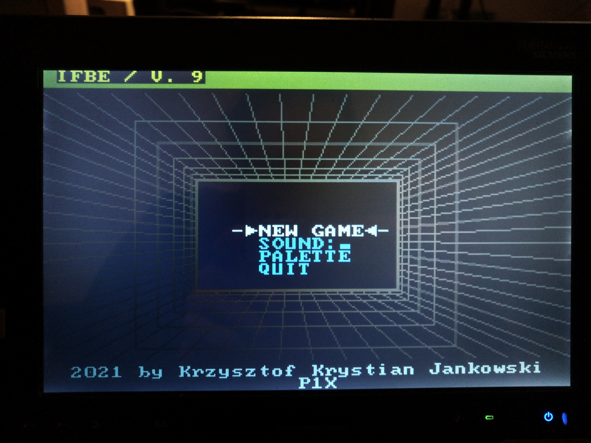
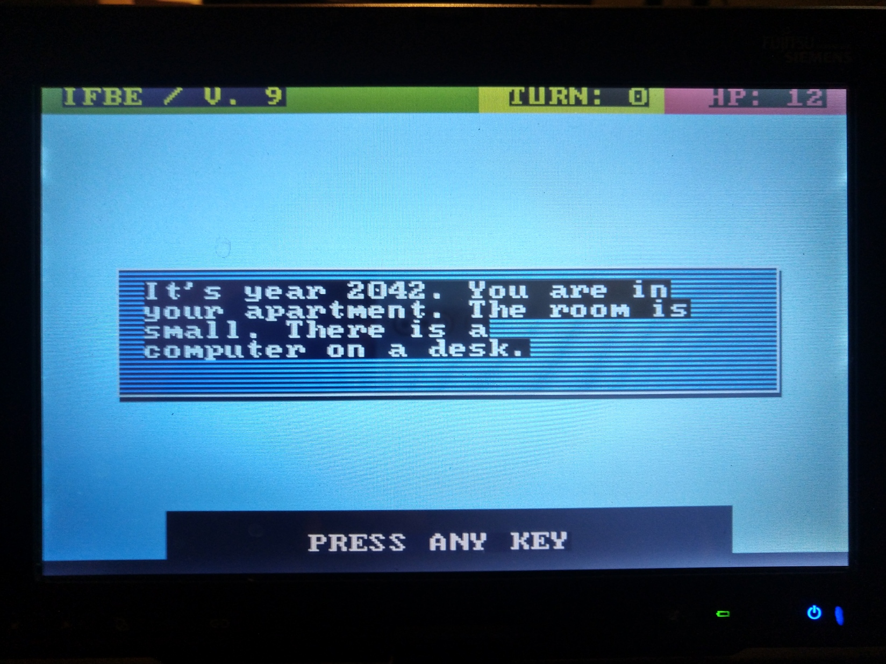

# Interactive Fiction BASIC Engine

Made on a real DOS maschine (MS DOS 5.5) in QuickBASIC 4.5.

More about my [developer DOS setup here](https://bits.p1x.in/using-ms-dos-and-wordstar-in-2021/).

My game engine for [Interactive Fiction](https://en.wikipedia.org/wiki/Interactive_fiction), text-based games for DOS. It uses super simple script language for the gameplay logic (the story.)

## Documentation

Engine requies two files:
- save.dat
- script.dat

In the <save.dat> file there needs to be two lines representing scene number 
and player life.

Most important file is <script.dat> that holds the whole story.

## ChangeLog

- V1 - initial logic w/ scritp parser
- V4 - refctors, proper sound handling, menu
- V5 - intro w/ 3D model, word-wrapping
- V6 - optimalizations, color palette visualization
- V7 - refactor draw window
- V9 - rename, custom arne 16 palette, layout cleanup
- V10 - code refactor, restore/create save.dat and script.dat

## Planned

- music refactor + new tunes
- demo story that utilize all the engine features
- story editor
- sound editor/compositor 

## Footer

More info at https://bits.p1x.in and https://krzysztofjankowski.com.
